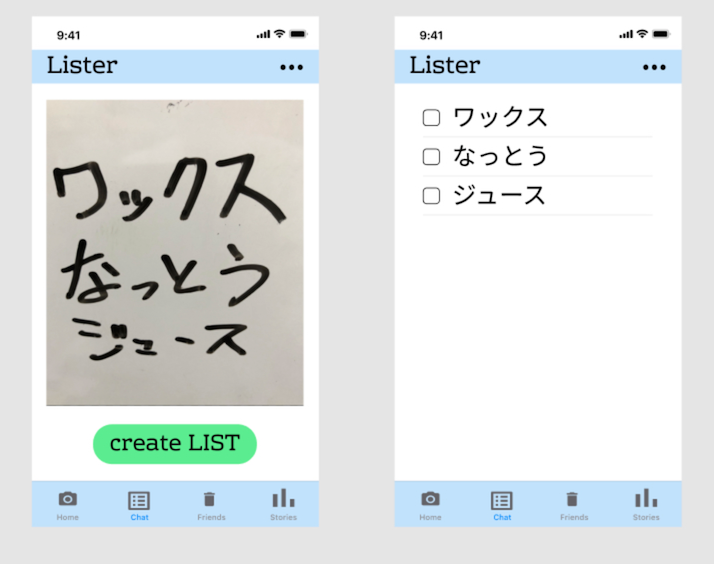

<!-- PC,ゲーム,仕事,マイクラダンジョンズ -->


# こんにちは
`これはブログです`
***
[link](#こんにちは)
```javascript
const hello = `this is code block`
コードブロックの表示
```
```html
<h1>こんにちは</h1>
```

*イタリック*

1. num
1. num

==hello==

**強調**

