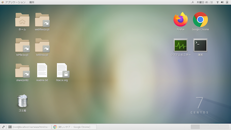
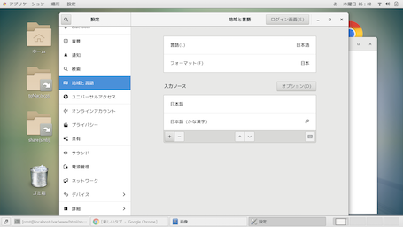

<!-- 2021-07-25 01:58:01 -->
<!-- 雑記 -->
<!-- os, linux, centos -->


長年放置されていた古ノートPCにlinuxを入れた際の備忘録です。
windowsを削除しCentOS7をインストールしました。

CentoOS7をインストールしたあとの設定を記載しています。

# yumリポジトリ情報のアップデート
これからインストールするパッケージ類が古いものがインストールされないようリポジトリ情報をアップデートします。
```bash
yum -y update
```
# selinuxの無効化
これが作動しているとセキュリティが働いて上手くいかないようなので無効化します。
```bash
vi /etc/selinux/config
```
configファイル内の下記部分を修正
```bash
SELINUX=enforcing → disabled
```
下記コマンドで確認
```bash
getenforce
```
# tabキー補完機能のインストール
端末上でtabキー補完が効くようになる機能です。
ファイル名を全部入力しなくても良くなるので非常に便利です。
```bash
yum install bash-completion
```
# デスクトップのインストール
基本的に端末で作業を行っていきますが、やはりGUIもあると便利です。
指定できる統合デスクトップ環境の確認は
```bash
yum grouplist
```
で出来ます。
`GNOME Desktop`か`KDE Plasma Workspaces`
をインストールします。
前者は軽量、後者はやや重ですがどちらでも大丈夫です。
```bash
yum groupinstall "KDE Plasma Workspaces"
```
```bash
yum groupinstall "GNOME Desktop"
```
インストールが完了したら(けっこう時間かかります)
```bash
startx
```
でデスクトップが起動します。


ここまででデスクトップは使えますが、この状態でPCを再起動した際にはCUIで起動します。

デフォルトをGUIで起動したい場合は`systemctl set-default`コマンドで`multi-user.target`から`graphical.target`に設定を変更します。
```bash
systemctl set-default graphical.target
```
起動時の設定を確認
`graphical.target`と表示されればOKです。
```bash
systemctl get-default
```
PCを再起動します。
```bash
reboot
```
# sudoコマンドが使えない時
デフォルトでsudoコマンドが使えない場合があります。
rootユーザーでも作業は行えますが推奨されていないようですので、一般ユーザーの状態で要所要所でsudoコマンドを使って作業をしていった方が良さそうです。


`su -`コマンドでrootユーザーに切り替えてから`visudo`コマンドで設定を追加します。
```bash
su -
```
```bash
visudo
```
ファイル内の`//追記`の部分を追記します。
`[ユーザー名]`はsudoコマンドを使いたいユーザー名を入れてください。[ ]はいりません。
```bash
%wheel ALL=(ALL) ALL
[ユーザー名] ALL=(ALL) ALL  //追記
```
これで設定したユーザーはsudoコマンドを使えるようになります。

# 日本語入力を有効にする
デフォルトでは英語しか入力できないと思います。
google検索時などちょっと不便でしたので日本語入力のパッケージをインストールします。
>既存のPCでは当たり前の機能なので少し面倒くさいですが、こうやって自分で機能を拡張していけるのがlinuxの醍醐味だと思います。


既存のリポジトリに必要なパッケージ情報が無いため、必要なパッケージ情報が記載されているリポジトリを導入します。
```bash
yum install epel-release
```
リポジトリが追加されたか確認
```bash
yum repolist
```
日本語入力パッケージインストール
```bash
yum install mozc ibus-mozc
```
再起動
```bash
reboot
```
デスクトップで設定を変更します。
1. 右上のアイコンから設定画面を開きます
2. 地域と言語を選択
3. 入力ソースの左下＋ボタンから日本語(かな漢字)を選択



あと最後に`英字⇔日本語`の切り替えがデフォルトだとダルい感じなので
- 設定 > デバイス > キーボード > 次の入力ソース > 無効にする

にすると`半角/全角`キーでストレスなく切り替えができると思います！

それでは良いlinuxライフを！